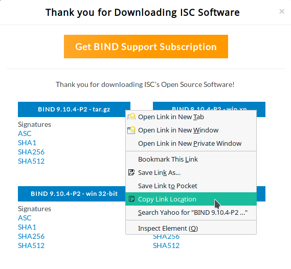

# Installing BIND 9 DNS Server on CentOS 7

This guide assumes the use of BIND v9.10.4-P2 (the most current version at the time of writing) and CentOS 7 minimal install. Any other versions of software or distributions may have different dependencies, options, or commands.

# Install CentOS 7

1. Start the machine with a CentOS install DVD inserted. Select the CD drive as the boot device if necessary.

2. When the CentOS install DVD boots, select "Install CentOS 7" from the menu using the arrow keys and hit the Enter key.  


 <div class="page-break"></div>

3. After the installer loads, make sure that "English (United States)" is selected as the language and click the Continue button.  


 <div class="page-break"></div>

4. On the main install screen, click "Network & Host Name"  


 <div class="page-break"></div>

5. Enter the desired hostname in the "Host name" box. If the computer should use DHCP instead of a static IP, skip the next step. If a static IP is needed, click the "Configure" button.  


 <div class="page-break"></div>

6. To configure the static IP, select the "IPv4 Settings" tab, select "Manual" from the drop-down menu, and click the Add button. Enter the desired IP address, netmask (or CIDR mask), and gateway. List the DNS servers to use in the "DNS Servers" box, each one separated by commas. Click the Save button.  


 <div class="page-break"></div>

7. Click the On/Off toggle to turn the network interface on. If no static IP was entered, DHCP will be used. Click the Done button.  


 <div class="page-break"></div>

8. Back on the main install screen, click "Date & Time".  


 <div class="page-break"></div>

9. Select the appropriate time zone. For US Central time, select "Americas/Chicago". Make sure the the "Network Time" in the upper right is set to "On". Click the Done button.


 <div class="page-break"></div>

10. Back on the main install screen, click "Installation Destination".


 <div class="page-break"></div>

11. Make sure that "Automatically configure partitioning" is selected. Click the Done button.


 <div class="page-break"></div>

12. Back on the main install screen, click the Begin Installation button.


 <div class="page-break"></div>

13. While the operating system is being installed, click "Root Password".


 <div class="page-break"></div>

14. Enter the desired root user password in both boxes. Click the Done button.


 <div class="page-break"></div>

15. After the install has finished, click the Reboot button.


16. Make sure to remove the install disk from the CD drive

<div class="page-break"></div>

# Prerequisites

**Note that some of these dependencies are for the BIND application and others are useful utilities to aid in setup and not strictly dependencies.**

1. Once the system has restarted to the login prompt, login with the username `root` and the password that was set during the install.

2. Install dependencies.
 ```
yum install screen vim bind-utils wget openssl-devel gcc automake net-tools checkpolicy policycoreutils-python perl-Net-DNS-Nameserver perl-IO-Socket-INET6
 ```

3. Update the system
 ```
yum update
 ```

4. After the system is updated, reboot the system.
 ```
reboot
 ```

5. When the system has finished restarting, log back in as the `root` user.

6. Create the `named` user that BIND will run as. This is important to ensure that BIND does not run with `root` privileges.
 ```
useradd -r -M -d /var/named/chroot -s /sbin/nologin named
 ```

7. Add a non-root user, set the password, and allow the user to run commands via `sudo`. Replace **username** with the desired username.
 ```
useradd username
passwd username
echo "username ALL=(ALL) ALL" >> /etc/sudoers
 ```

8. Log into the non-root user account. Replace **username** with the chosen username. Enter the previously set password when prompted. After logging in, change into the non-root user's home directory.
 ```
su username -
cd
 ```

<div class="page-break"></div>

# Install BIND

**All remaining steps should be done with the non-root user account. See [Prerequisites section](#prerequisites) for logging into the non-root account.**

## Download and Verify

1. Go to the Internet Systems Consortium website in the dowloads section: [https://www.isc.org/downloads/](https://www.isc.org/downloads/). Click on the 'BIND' option under 'Downloads' to expand the availiable downloads. Click on the Download button for the 'Current-Stable' release.  


<div class="page-break"></div>

2. In the popup box, right click on the `tar.gz` download box and click 'Save Link As' to copy the file URL to the clipboard.  


3. On the command line of the CentOS 7 server, use `wget` to download the file. Paste the file URL previously copied where **file-url** is in the command below.
 ```
wget file-url -O bind.tar.gz
 ```

4. In the same popup box where the `tar.gz` file URL was copied on the ISC website, also copy the URL of the 'SHA512' file listed under the `tar.gz` box.

5. On the command line of the CentOS 7 server, use `wget` to download the 'SHA512' file. Paste the file URL previously copied where **file-url** is in the command below.
 ```
wget file-url -O bind.sha512.asc
 ```

6. Import the ISC GPG key to verify the downloaded file.
 ```
gpg --keyserver pgp.mit.edu --search-keys codesign@isc.org
 ```
 Select the current signing key (the one that is not expired) by typing the number and hitting Enter.
 ```
 gpg: directory `/home/username/.gnupg' created
 gpg: new configuration file `/home/username/.gnupg/gpg.conf' created
 gpg: WARNING: options in `/home/username/.gnupg/gpg.conf' are not yet active during this run
 gpg: keyring `/home/username/.gnupg/secring.gpg' created
 gpg: keyring `/home/username/.gnupg/pubring.gpg' created
 gpg: searching for "codesign@isc.org" from hkp server pgp.mit.edu
 (1)     Internet Systems Consortium, Inc. (Signing key, 2015-2016) <codesign@i
           2048 bit RSA key 911A4C02, created: 2014-12-02, expires: 2017-01-31
 (2)     Internet Systems Consortium, Inc. (Signing key, 2013) <codesign@isc.or
           2048 bit RSA key 189CDBC5, created: 2013-01-31, expires: 2015-01-31 (expired)
 (3)     Internet Systems Consortium, Inc. (Signing key, 2012) (http://www.isc.
           2048 bit RSA key C96B350A, created: 2011-10-27, expires: 2013-02-01 (expired)
 Keys 1-3 of 3 for "codesign@isc.org".  Enter number(s), N)ext, or Q)uit > 1
 gpg: requesting key 911A4C02 from hkp server pgp.mit.edu
 gpg: /home/username/.gnupg/trustdb.gpg: trustdb created
 gpg: key 911A4C02: public key "Internet Systems Consortium, Inc. (Signing key, 2015-2016) <codesign@isc.org>" imported
 gpg: no ultimately trusted keys found
 gpg: Total number processed: 1
 gpg:               imported: 1  (RSA: 1)
 ```

7. Verify the downloaded BIND software with the downloaded `SHA512` hash.
  ```
gpg --verify bind.sha512.asc bind.tar.gz
 ```
 If the output shows `Good signature`, then the download is verified. Ignore the warning message about the key not being certified with a trusted signature.
 ```
 gpg: Signature made Mon 18 Jul 2016 05:59:45 PM CDT using RSA key ID 911A4C02
 gpg: checking the trustdb
 gpg: no ultimately trusted keys found
 gpg: Good signature from "Internet Systems Consortium, Inc. (Signing key, 2015-2016) <codesign@isc.org>"
 gpg: WARNING: This key is not certified with a trusted signature!
 gpg:          There is no indication that the signature belongs to the owner.
 Primary key fingerprint: ADBE 9446 286C 7949 05F1  E075 6FA6 EBC9 911A 4C02
 ```

<div class="page-break"></div>

## Compile

1. Make a new empty directory to extract the BIND source code.
 ```
mkdir bind
 ```

2. Untar the downloaded BIND source code.
 ```
tar -xvf bind.tar.gz -C bind --strip 1
 ```

3. Change into the new directory.
 ```
cd bind
 ```

4. Run the script to configure the compilation options.
 ```
./configure --prefix=/usr --sysconfdir=/etc --enable-threads --enable-static --localstatedir=/var
 ```

5. Compile BIND.
 ```
make
 ```

<div class="page-break"></div>

## Test

1. Enable the test environment.
 ```
sudo bin/tests/system/ifconfig.sh up
 ```

2. Check the built software, saving the output to a log file.
 ```
make check | tee check.log
 ```
 **Note:** This checking process will take a very long time, usually more than 15 minutes.  
 **Note:** It is helpful to save the output to a log file because it is extremely long and it may be necessary to search through it to find any problems with the checks.

3. **None of the tests should have the result `FAIL`.** Any results that have `SKIPPED` or `UNTESTED` are fine.
 ```
 I:System test result summary:
 I:      69 PASS
 I:       7 SKIPPED
 I:       2 UNTESTED
 ```

4. If any tests have the result `FAIL`, clean the current build and start from the beginning of the [Compile](#compile) section. Otherwise, skip this step and continue.
 ```
make clean
 ```

5. Disable the test environment.
 ```
sudo bin/tests/system/ifconfig.sh down
 ```

## Install

1. Install BIND.
 ```
sudo make install
 ```

2. Create the necessary directories for the BIND chroot environment.
 ```
sudo mkdir -p /var/named/chroot/dev /var/named/chroot/etc /var/named/chroot/proc /var/named/chroot/usr /var/named/chroot/var/named/data /var/named/chroot/var/run/named /var/named/chroot/run/named /var/named/chroot/var/named/slaves
 ```

3. Create a new file for the chroot setup script. Press the 'i' key to enter insert mode.
 ```
sudo vim -c "set paste" /usr/libexec/setup-named-chroot.sh
 ```

4. Copy the following code and paste it into the file. Return to normal mode by pressing Esc. Save and close the file by typing `:x`.
 ```bash
 #!/bin/bash
 usage() {
   echo
   echo 'This script setups chroot environment for BIND'
   echo 'Usage: setup-named-chroot.sh ROOTDIR [on|off]'
 }
 if ! [ "$#" -eq 2 ]; then
   echo 'Wrong number of arguments'
   usage
   exit 1
 fi
 ROOTDIR="$1"
 # Exit if ROOTDIR doesn't exist
 if ! [ -d "$ROOTDIR" ]; then
   echo "Root directory $ROOTDIR doesn't exist"
   usage
   exit 1
 fi
 mount_chroot_conf() {
 if [ -s /etc/localtime ]; then
         cp -fp /etc/localtime ${ROOTDIR}/etc/localtime
 fi;
 if [ ! -d ${ROOTDIR}/proc ]; then
         mkdir -p ${ROOTDIR}/proc
 fi
 if ! egrep -q '^/proc[[:space:]]+'${ROOTDIR}'/proc' /proc/mounts; then
         mount --bind -n /proc ${ROOTDIR}/proc >/dev/null 2>&1
 fi
 }
 umount_chroot_conf() {
   if [ -n "$ROOTDIR" ]; then
         umount ${ROOTDIR}/proc
   fi
 }
 case "$2" in
   on)
     mount_chroot_conf
     ;;
   off)
     umount_chroot_conf
     ;;
   *)
     echo 'Second argument has to be "on" or "off"'
     usage
     exit 1
 esac
  ```

5. Create the pseudo-devices for the chroot environment.
 ```
sudo mknod /var/named/chroot/dev/null c 1 3
sudo mknod /var/named/chroot/dev/random c 1 8
 ```

6. Set the appropriate file and directory permissions.
 ```
sudo chmod 740 /usr/libexec/setup-named-chroot.sh
sudo chown -R root.named /var/named/chroot/etc /var/named/chroot/var/run/named /var/named/chroot/var/run
sudo chown -R named.named /var/named/chroot/var/named
sudo restorecon -R /var/namech/chroot/*
sudo setsebool -P named_write_master_zones on
 ```

7. Create a file for the systemd startup of the chroot environment. Press the 'i' key to enter insert mode.
 ```
sudo vim -c "set paste" /usr/lib/systemd/system/named-chroot-setup.service
 ```

8. Copy and paste the following into the file. Return to normal mode by pressing Esc. Save and close the file by typing `:x`.
 ```
[Unit]
Description=Set-up/destroy chroot environment for named (DNS)
BindsTo=named.service
[Service]
Type=oneshot
RemainAfterExit=yes
ExecStart=/usr/libexec/setup-named-chroot.sh /var/named/chroot on
ExecStop=/usr/libexec/setup-named-chroot.sh /var/named/chroot off
 ```

9. Create a file for the systemd startup of BIND. Press the 'i' key to enter insert mode.
 ```
sudo vim -c "set paste" /usr/lib/systemd/system/named.service
 ```

10. Copy and paste the following into the file. Return to normal mode by pressing Esc. Save and close the file by typing `:x`.
 ```
[Unit]
Description=Berkeley Internet Name Domain (DNS)
Wants=nss-lookup.target
Requires=named-chroot-setup.service
Before=nss-lookup.target
After=network.target
After=named-chroot-setup.service
[Service]
Type=forking
EnvironmentFile=-/etc/sysconfig/named
Environment=KRB5_KTNAME=/etc/named.keytab
ExecStartPre=/usr/sbin/named-checkconf -t /var/named/chroot -z /etc/named.conf
ExecStart=/usr/sbin/named -u named -t /var/named/chroot $OPTIONS
ExecReload=/bin/sh -c '/usr/sbin/rndc reload > /dev/null 2>&1 || /bin/kill -HUP $MAINPID'
ExecStop=/bin/sh -c '/usr/sbin/rndc stop > /dev/null 2>&1 || /bin/kill -TERM $MAINPID'
PrivateTmp=false
[Install]
WantedBy=multi-user.target
 ```

11. Restart the systemd daemon to load the new startup files.
 ```
sudo systemctl daemon-reload
 ```

# Configure BIND

1. Create the new config file. Press the 'i' key to enter insert mode.
 ```
sudo vim -c 'set paste' /var/named/chroot/etc/named.conf
 ```

2. Copy and paste the following into the file. Return to normal mode by pressing Esc. Save and close the file by typing `:x`.
 ```
options {
       directory "/var/named";
       pid-file "/var/run/named/named.pid";
       statistics-file "/var/run/named/named.stats";
};
zone "." {
       type hint;
       file "root.hints";
};
zone "0.0.127.in-addr.arpa" {
       type master;
       file "0.0.127.in-addr.arpa";
};
logging {
       category default { default_syslog; default_debug; };
       category unmatched { null; };
       channel default_syslog { syslog daemon; severity info; };
       channel default_debug { file "named.run"; severity dynamic; };
       channel default_stderr { stderr; severity info; };
       channel null { null; };
};
 ```

3. Create the `rndc` configuration.
 ```
sudo su -c 'rndc-confgen -r /dev/urandom -b 512 > /var/named/chroot/etc/rndc.conf'
 ```

4. Add the necessary configuration to the `named.conf` for `rndc`.
 ```
sed '/conf/d;/^#/!d;s:^# ::' /var/named/chroot/etc/rndc.conf | sudo tee -a /var/named/chroot/etc/named.conf >/dev/null
 ```

5. Create the file for an SELinux policy. Press the 'i' key to enter insert mode.
 ```
vim -c 'set paste' /tmp/named-custom.te
 ```

6. Copy and paste the following into the file. Return to normal mode by pressing Esc. Save and close the file by typing `:x`.
 ```
module named-custom 1.0;
require {
       type sysctl_net_t;
       type named_t;
       class dir search;
       class file { read getattr open };
}
#============= named_t ==============
allow named_t sysctl_net_t:dir search;
allow named_t sysctl_net_t:file { read getattr open };
 ```

7. Build and load the policy into SELinux.
 ```
checkmodule -M -m -o /tmp/named-custom.mod /tmp/named-custom.te && semodule_package -o /tmp/named-custom.pp -m /tmp/named-custom.mod && sudo semodule -i /tmp/named-custom.pp
 ```

8. Start the BIND service.
 ```
sudo systemctl start named
 ```

9. Enable BIND to run on startup.
 ```
sudo systemctl enable named
 ```
