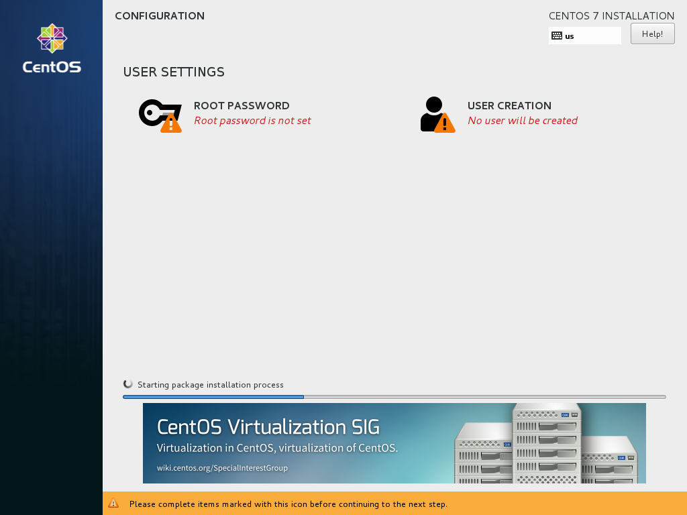
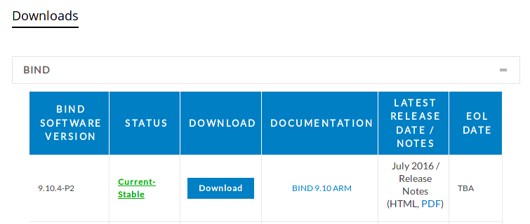

# Installing BIND 9 DNS Server on CentOS 7

This guide assumes the use of BIND v9.10.4-P2 (the most current version at the time of writing) and CentOS 7 minimal install. Any other versions of software or distributions may have different dependencies, options, or commands.

# Caveats

- If a forward zone is to be configured on the BIND DNS server, not just any zone can be used, except for the purposes of experimentation or local use.
 - If a zone such as `google.com` were configured on the server, it would not be usable by anyone in the world except those users of the particular DNS server.
 - Although it is possible to "over-ride" a zone in this way, it is not recommended.
 - Instead, a real domain name may be purchases from a domain registrar and set to use the BIND DNS server as its authoratative DNS server.
 - Then and only then will the zone be valid world-wide.
- This guide assumes some basic familiarity with the Linux command line and the RedHat/CentOS/Fedora family of distributions.

# Install CentOS 7

1. Start the machine with a CentOS install DVD inserted. Select the CD drive as the boot device if necessary.

2. When the CentOS install DVD boots, select "Install CentOS 7" from the menu using the arrow keys and hit the Enter key.  


 <div class="page-break"></div>

3. After the installer loads, make sure that "English (United States)" is selected as the language and click the Continue button.  


 <div class="page-break"></div>

4. On the main install screen, click "Network & Host Name"  


 <div class="page-break"></div>

5. Enter the desired hostname in the "Host name" box. If the computer should use DHCP instead of a static IP, skip the next step. If a static IP is needed, click the "Configure" button.  


 <div class="page-break"></div>

6. To configure the static IP, select the "IPv4 Settings" tab, select "Manual" from the drop-down menu, and click the Add button. Enter the desired IP address, netmask (or CIDR mask), and gateway. List the DNS servers to use in the "DNS Servers" box, each one separated by commas. Click the Save button.  


 <div class="page-break"></div>

7. Click the On/Off toggle to turn the network interface on. If no static IP was entered, DHCP will be used. Click the Done button.  


 <div class="page-break"></div>

8. Back on the main install screen, click "Date & Time".  


 <div class="page-break"></div>

9. Select the appropriate time zone. For US Central time, select "Americas/Chicago". Make sure the the "Network Time" in the upper right is set to "On". Click the Done button.


 <div class="page-break"></div>

10. Back on the main install screen, click "Installation Destination".


 <div class="page-break"></div>

11. Make sure that "Automatically configure partitioning" is selected. Click the Done button.


 <div class="page-break"></div>

12. Back on the main install screen, click the Begin Installation button.


 <div class="page-break"></div>

13. While the operating system is being installed, click "Root Password".


 <div class="page-break"></div>

14. Enter the desired root user password in both boxes. Click the Done button.


 <div class="page-break"></div>

15. After the install has finished, click the Reboot button.


16. Make sure to remove the install disk from the CD drive

<div class="page-break"></div>

# Prerequisites

**Note that some of these dependencies are for the BIND application and others are useful utilities to aid in setup and not strictly dependencies.**

1. Once the system has restarted to the login prompt, login with the username `root` and the password that was set during the install.

2. Install dependencies.
 ```
yum install screen vim bind-utils wget openssl-devel gcc automake net-tools checkpolicy policycoreutils-python perl-Net-DNS-Nameserver perl-IO-Socket-INET6
 ```

3. Update the system
 ```
yum update
 ```

4. After the system is updated, reboot the system.
 ```
reboot
 ```

5. When the system has finished restarting, log back in as the `root` user.

6. Create the `named` user that BIND will run as. This is important to ensure that BIND does not run with `root` privileges.
 ```
useradd -r -M -d /var/named/chroot -s /sbin/nologin named
 ```

7. Allow DNS queries through the host firewall.
 ```
firewall-cmd --permanent --add-service=dns
firewall-cmd --reload
 ```
8. Create the file for an SELinux policy. Press the 'i' key to enter insert mode.
 ```
vim -c 'set paste' /tmp/named-custom.te
 ```

9. Copy and paste the following into the file. Return to normal mode by pressing Esc. Save and close the file by typing `:x`.
 ```
module named-custom 1.0;
require {
      type sysctl_net_t;
      type named_t;
      class dir search;
      class file { read getattr open };
}
#============= named_t ==============
allow named_t sysctl_net_t:dir search;
allow named_t sysctl_net_t:file { read getattr open };
 ```

10. Build and load the policy into SELinux.
 ```
checkmodule -M -m -o /tmp/named-custom.mod /tmp/named-custom.te && semodule_package -o /tmp/named-custom.pp -m /tmp/named-custom.mod && semodule -i /tmp/named-custom.pp
 ```

11. Add a non-root user, set the password, and allow the user to run commands via `sudo`. Replace **username** with the desired username.
 ```
useradd username
passwd username
echo "username ALL=(ALL) ALL" >> /etc/sudoers
 ```

12. Log into the non-root user account. Replace **username** with the chosen username. Enter the previously set password when prompted. After logging in, change into the non-root user's home directory.
 ```
su username -
cd
 ```

<div class="page-break"></div>

# Install BIND

**All remaining steps should be done with the non-root user account. See [Prerequisites section](#prerequisites) for logging into the non-root account.**

## Download and Verify

1. Go to the Internet Systems Consortium website in the downloads section: [https://www.isc.org/downloads/](https://www.isc.org/downloads/). Click on the 'BIND' option under 'Downloads' to expand the available downloads. Click on the Download button for the 'Current-Stable' release.  


<div class="page-break"></div>

2. In the popup box, right click on the `tar.gz` download box and click 'Save Link As' to copy the file URL to the clipboard.  


3. On the command line of the CentOS 7 server, use `wget` to download the file. Paste the file URL previously copied where **file-url** is in the command below.
 ```
wget file-url -O bind.tar.gz
 ```

4. In the same popup box where the `tar.gz` file URL was copied on the ISC website, also copy the URL of the 'SHA512' file listed under the `tar.gz` box.

5. On the command line of the CentOS 7 server, use `wget` to download the 'SHA512' file. Paste the file URL previously copied where **file-url** is in the command below.
 ```
wget file-url -O bind.sha512.asc
 ```

6. Import the ISC GPG key to verify the downloaded file.
 ```
gpg --keyserver pgp.mit.edu --search-keys codesign@isc.org
 ```
 Select the current signing key (the one that is not expired) by typing the number and hitting Enter.
 ```
 gpg: directory `/home/username/.gnupg' created
 gpg: new configuration file `/home/username/.gnupg/gpg.conf' created
 gpg: WARNING: options in `/home/username/.gnupg/gpg.conf' are not yet active during this run
 gpg: keyring `/home/username/.gnupg/secring.gpg' created
 gpg: keyring `/home/username/.gnupg/pubring.gpg' created
 gpg: searching for "codesign@isc.org" from hkp server pgp.mit.edu
 (1)     Internet Systems Consortium, Inc. (Signing key, 2015-2016) <codesign@i
           2048 bit RSA key 911A4C02, created: 2014-12-02, expires: 2017-01-31
 (2)     Internet Systems Consortium, Inc. (Signing key, 2013) <codesign@isc.or
           2048 bit RSA key 189CDBC5, created: 2013-01-31, expires: 2015-01-31 (expired)
 (3)     Internet Systems Consortium, Inc. (Signing key, 2012) (http://www.isc.
           2048 bit RSA key C96B350A, created: 2011-10-27, expires: 2013-02-01 (expired)
 Keys 1-3 of 3 for "codesign@isc.org".  Enter number(s), N)ext, or Q)uit > 1
 gpg: requesting key 911A4C02 from hkp server pgp.mit.edu
 gpg: /home/username/.gnupg/trustdb.gpg: trustdb created
 gpg: key 911A4C02: public key "Internet Systems Consortium, Inc. (Signing key, 2015-2016) <codesign@isc.org>" imported
 gpg: no ultimately trusted keys found
 gpg: Total number processed: 1
 gpg:               imported: 1  (RSA: 1)
 ```

7. Verify the downloaded BIND software with the downloaded `SHA512` hash.
  ```
gpg --verify bind.sha512.asc bind.tar.gz
 ```
 If the output shows `Good signature`, then the download is verified. Ignore the warning message about the key not being certified with a trusted signature.
 ```
 gpg: Signature made Mon 18 Jul 2016 05:59:45 PM CDT using RSA key ID 911A4C02
 gpg: checking the trustdb
 gpg: no ultimately trusted keys found
 gpg: Good signature from "Internet Systems Consortium, Inc. (Signing key, 2015-2016) <codesign@isc.org>"
 gpg: WARNING: This key is not certified with a trusted signature!
 gpg:          There is no indication that the signature belongs to the owner.
 Primary key fingerprint: ADBE 9446 286C 7949 05F1  E075 6FA6 EBC9 911A 4C02
 ```

<div class="page-break"></div>

## Compile

1. Make a new empty directory to extract the BIND source code.
 ```
mkdir bind
 ```

2. Untar the downloaded BIND source code.
 ```
tar -xvf bind.tar.gz -C bind --strip 1
 ```

3. Change into the new directory.
 ```
cd bind
 ```

4. Run the script to configure the compilation options.
 ```
./configure --prefix=/usr --sysconfdir=/etc --enable-threads --enable-static --localstatedir=/var
 ```

5. Compile BIND.
 ```
make
 ```

<div class="page-break"></div>

## Test

1. Enable the test environment.
 ```
sudo bin/tests/system/ifconfig.sh up
 ```

2. Check the built software, saving the output to a log file.
 ```
make check | tee check.log
 ```
 **Note:** This checking process will take a very long time, usually more than 15 minutes.  
 **Note:** It is helpful to save the output to a log file because it is extremely long and it may be necessary to search through it to find any problems with the checks.

3. **None of the tests should have the result `FAIL`.** Any results that have `SKIPPED` or `UNTESTED` are fine.
 ```
 I:System test result summary:
 I:      69 PASS
 I:       7 SKIPPED
 I:       2 UNTESTED
 ```

4. If any tests have the result `FAIL`, clean the current build and start from the beginning of the [Compile](#compile) section. Otherwise, skip this step and continue.
 ```
make clean
 ```

5. Disable the test environment.
 ```
sudo bin/tests/system/ifconfig.sh down
 ```

<div class="page-break"></div>

## Install

1. Install BIND.
 ```
sudo make install
 ```

2. Create the necessary directories for the BIND chroot environment.
 ```
sudo mkdir -p /var/named/chroot/dev /var/named/chroot/etc /var/named/chroot/proc /var/named/chroot/usr /var/named/chroot/var/named/data /var/named/chroot/var/run/named /var/named/chroot/run/named /var/named/chroot/var/named/slaves
 ```

3. Create a new file for the chroot setup script. Press the 'i' key to enter insert mode.
 ```
sudo vim -c "set paste" /usr/libexec/setup-named-chroot.sh
 ```

4. Copy the following code and paste it into the file. Return to normal mode by pressing Esc. Save and close the file by typing `:x`.
 ```
 #!/bin/bash
 usage() {
   echo
   echo 'This script setups chroot environment for BIND'
   echo 'Usage: setup-named-chroot.sh ROOTDIR [on|off]'
 }
 if ! [ "$#" -eq 2 ]; then
   echo 'Wrong number of arguments'
   usage
   exit 1
 fi
 ROOTDIR="$1"
 # Exit if ROOTDIR doesn't exist
 if ! [ -d "$ROOTDIR" ]; then
   echo "Root directory $ROOTDIR doesn't exist"
   usage
   exit 1
 fi
 mount_chroot_conf() {
 if [ -s /etc/localtime ]; then
         cp -fp /etc/localtime ${ROOTDIR}/etc/localtime
 fi;
 if [ ! -d ${ROOTDIR}/proc ]; then
         mkdir -p ${ROOTDIR}/proc
 fi
 if ! egrep -q '^/proc[[:space:]]+'${ROOTDIR}'/proc' /proc/mounts; then
         mount --bind -n /proc ${ROOTDIR}/proc >/dev/null 2>&1
 fi
 }
 umount_chroot_conf() {
   if [ -n "$ROOTDIR" ]; then
         umount ${ROOTDIR}/proc
   fi
 }
 case "$2" in
   on)
     mount_chroot_conf
     ;;
   off)
     umount_chroot_conf
     ;;
   *)
     echo 'Second argument has to be "on" or "off"'
     usage
     exit 1
 esac
 ```

5. Create the pseudo-devices for the chroot environment.
 ```
sudo mknod /var/named/chroot/dev/null c 1 3
sudo mknod /var/named/chroot/dev/random c 1 8
 ```

6. Set the appropriate file and directory permissions.
 ```
sudo chmod 740 /usr/libexec/setup-named-chroot.sh
sudo chown -R root.named /var/named/chroot/etc /var/named/chroot/var/run/named /var/named/chroot/var/run
sudo chown -R named.named /var/named/chroot/var/named
sudo restorecon -R /var/named/chroot/*
sudo setsebool -P named_write_master_zones on
 ```

7. Create a file for the systemd startup of the chroot environment. Press the 'i' key to enter insert mode.
 ```
sudo vim -c "set paste" /usr/lib/systemd/system/named-chroot-setup.service
 ```

8. Copy and paste the following into the file. Return to normal mode by pressing Esc. Save and close the file by typing `:x`.
 ```
[Unit]
Description=Set-up/destroy chroot environment for named (DNS)
BindsTo=named.service
[Service]
Type=oneshot
RemainAfterExit=yes
ExecStart=/usr/libexec/setup-named-chroot.sh /var/named/chroot on
ExecStop=/usr/libexec/setup-named-chroot.sh /var/named/chroot off
 ```

9. Create a file for the systemd startup of BIND. Press the 'i' key to enter insert mode.
 ```
sudo vim -c "set paste" /usr/lib/systemd/system/named.service
 ```

10. Copy and paste the following into the file. Return to normal mode by pressing Esc. Save and close the file by typing `:x`.
 ```
[Unit]
Description=Berkeley Internet Name Domain (DNS)
Wants=nss-lookup.target
Requires=named-chroot-setup.service
Before=nss-lookup.target
After=network.target
After=named-chroot-setup.service
[Service]
Type=forking
EnvironmentFile=-/etc/sysconfig/named
Environment=KRB5_KTNAME=/etc/named.keytab
ExecStartPre=/usr/sbin/named-checkconf -t /var/named/chroot -z /etc/named.conf
ExecStart=/usr/sbin/named -u named -t /var/named/chroot $OPTIONS
ExecReload=/bin/sh -c '/usr/sbin/rndc reload > /dev/null 2>&1 || /bin/kill -HUP $MAINPID'
ExecStop=/bin/sh -c '/usr/sbin/rndc stop > /dev/null 2>&1 || /bin/kill -TERM $MAINPID'
PrivateTmp=false
[Install]
WantedBy=multi-user.target
 ```

11. Restart the systemd daemon to load the new startup files.
 ```
sudo systemctl daemon-reload
 ```

<div class="page-break"></div>

# Configure BIND

## Basic Configuration

This is the minimum configuration needed for the BIND server to start and run as a basic caching DNS server. Additional configuration and security settings can be found in later sections.

1. Create the new config file. Press the 'i' key to enter insert mode.
 ```
sudo vim -c 'set paste' /var/named/chroot/etc/named.conf
 ```

2. Copy and paste the following into the file. Return to normal mode by pressing Esc. Save and close the file by typing `:x`.
 ```
options {
       directory "/var/named";
       pid-file "/var/run/named/named.pid";
       statistics-file "/var/run/named/named.stats";
};
zone "." {
       type hint;
       file "root.hints";
};
zone "0.0.127.in-addr.arpa" {
       type master;
       file "0.0.127.in-addr.arpa";
};
logging {
       category default { default_syslog; default_debug; };
       category unmatched { null; };
       channel default_syslog { syslog daemon; severity info; };
       channel default_debug { file "named.run"; severity dynamic; };
       channel default_stderr { stderr; severity info; };
       channel null { null; };
};
 ```

3. Create the `rndc` configuration.
 ```
sudo su -c 'rndc-confgen -r /dev/urandom -b 512 > /var/named/chroot/etc/rndc.conf'
 ```

4. Add the necessary configuration to the `named.conf` for `rndc`.
 ```
sed '/conf/d;/^#/!d;s:^# ::' /var/named/chroot/etc/rndc.conf | sudo tee -a /var/named/chroot/etc/named.conf >/dev/null
 ```

5. Create the localhost reverse zone file.  Press the 'i' key to enter insert mode.
 ```
sudo vim -c 'set paste' /var/named/chroot/var/named/0.0.127.in-addr.arpa
 ```

6. Copy and paste the following into the file. Return to normal mode by pressing Esc. Save and close the file by typing `:x`.
 ```
$TTL 3D
@       IN SOA  ns.local.domain. hostmaster.local.domain. (
        2016010100      ; Serial
        8H              ; Refresh
        2H              ; Retry
        4W              ; Expire
        1D              ; Minimum TTL
        )
        NS      ns.local.domain.
1       PTR     localhost.
 ```

7. Create the root hints file.
 ```
sudo su -c 'dig +nocmd +noall +answer +additional @a.root-servers.net . NS > /var/named/chroot/var/named/root.hints'
 ```

8. Start the BIND service.
 ```
sudo systemctl start named
 ```

9. Enable BIND to run on startup.
 ```
sudo systemctl enable named
 ```

<div class="page-break"></div>

## Forward Zone Configuration

If desired, a forward zone can be configured on the DNS server. We will be using the `example.com` zone. A forward zone is one that translates names such as `example.com` into IP addresses such as `192.168.1.2`.

1. Create the zone file.  Press the 'i' key to enter insert mode.
 ```
sudo vim -c 'set paste' /var/named/chroot/var/named/example.com
 ```

2. Copy and paste the following into the file.  Return to normal mode by pressing Esc. Save and close the file by typing `:x`.
 ```
$TTL 3D
@      IN SOA  ns.example.com. hostmaster.example.com. (
       2016010100      ; serial
       8H              ; refresh, seconds
       2H              ; retry, seconds
       4W              ; expire, seconds
       1D )            ; minimum, seconds
       A       192.168.1.2
       NS      ns
ns     A       192.168.1.1
www    CNAME   @
 ```
 The basic components of the file are as follows. The values may be changed to fit the zone
 - `$TTL 3D` - The default time to live for the records in this zone. This is the amount of time that a caching name server will keep the record before letting it expire.
 - `@ IN SOA ns.example.com. hostmaster.example.com.` - The start of authority record for this zone. The `@` is automatically substituted with the zone name `example.com`. `ns.example.com` is the primary name server for this zone. It must have an `A` record, as seen later in the file. `hostmaster.example.com` is the administrator of the zone. Note the dot at the ends of both names. They are very important.
 - `2016010100` - The serial number, usually in the format `YYYYMMDDNN`, where the last two digits `NN` are a revision number for the date. This is used by slave servers to determine when there has been a change to the zone and they need to get an updated copy from the master server.
 - `8H` - The length of time before a slave server should be try to refresh the zone from the master.
 - `2H` - The time between retries if the slave fails to contact the master for the zone.
 - `4W` - The time until the zone is no longer authoratative. This value only applies to slave servers.
 - `1D` - The amount of time a caching name server should wait before retrying when an `NXDOMAIN` result is returned for the zone.
 - `A 192.168.1.2` - The `A` record for the zone. This means that `example.com` will resolve to `192.168.1.2`.
 - `NS ns` - The `NS` record for the zone that identifies the primary name server. It points to the name `ns`, which in turn has an `A` record that points to the IP address `192.168.1.1`.
 - `www CNAME @` - A `CNAME` or alias record for the zone. This is effectively the same as `www CNAME example.com.` because the `@` is substituted with the zone name. The alias record means that `www.example.com` will alias to `example.com` which will resolve to `192.168.1.2`.

3. Edit the `named.conf` file.   Press the 'i' key to enter insert mode.
 ```
sudo vim -c 'set paste' /var/named/chroot/etc/named.conf
 ```

4. Copy and paste the following into the file. Return to normal mode by pressing Esc. Save and close the file by typing `:x`.
 ```
zone "example.com" {
        type master;
        notify no;
        file "example.com";
};
 ```
 The basic components of the entry are as follows.
 - `zone "example.com"` - The zone definition. This gives the name to the zone.
 - `type master` - The zone is a master zone, meaning this server is authoratative for the zone.
 - `notify no;` - Do not send notifies to any other DNS servers. Sending notifies is unnecessary unless there are slave servers for the zone.
 - `file "example.com` - Defines the file that contains the zone records. This is a relative path based on the `directory` option earlier in the file.

5. Restart the BIND service.
 ```
sudo systemctl restart named
 ```

6. Test the new zone with some lookups. The results should show the server answering correctly for the zone.
  ```
dig @localhost +noall +answer example.com
 example.com.            259200  IN      A       192.168.1.2
dig @localhost +noall +answer www.example.com
 www.example.com.        259200  IN      CNAME   example.com.
 example.com.            259200  IN      A       192.168.1.2
dig @localhost +noall +answer +additional example.com NS
  example.com.            259200  IN      NS      ns.example.com.
  ns.example.com.         259200  IN      A       192.168.1.1
  ```

7. If any changes are made to the zone file, the serial number must be incremented by at least one. However, it is recommended to keep with the `YYYYMMDDNN` format that follows the date. After the changes to the file are saved, the `rndc` command can be used to reload the zones without restarting the BIND service.
 ```
rndc reload
 ```

<div class="page-break"></div>

## Reverse Zone Configuration

If desired, a reverse zone can be configured. The reverse zone resolves IP addresses such as `192.168.1.2` to names such as `example.com`. The reverse zone, unlike the forward zone, is tied to a classful subnet. This means that the IP address `192.168.1.2` would be in a different zone than `192.168.2.2`. The reverse zones are always named with the reversed octets of the network portion of the IP address followed by `.in-addr.arpa`. For this example, the zone will be `1.168.192.in-addr.arpa`.

1. Create the zone file.  Press the 'i' key to enter insert mode.
 ```
sudo vim -c 'set paste' /var/named/chroot/var/named/1.168.192.in-addr.arpa
 ```

2. Copy and paste the following into the file.   Return to normal mode by pressing Esc. Save and close the file by typing `:x`.
 ```
$TTL 3D
@      IN SOA  ns.example.com. hostmaster.example.com. (
       2016010103      ; serial
       8H              ; refresh, seconds
       2H              ; retry, seconds
       4W              ; expire, seconds
       1D )            ; minimum, seconds
       NS      ns.example.com.
1       PTR     ns.example.com.
2       PTR     example.com.
2       PTR     www.example.com.
 ```
 The `TTL`, `SOA`, and `NS` records are the same as in the forward zone. However, the other records are different.  
 The type of record for the reverse zone is `PTR`. Instead of the name on the left and the IP on the right as in an `A` record, they are reversed. On the left side, the reversed octects of the host portion of the IP address are listed. On the right side, the fully qualified domain name (FQDN) including the `.` at the end are listed. It is important to have the `.` at the end of the name to absolutely globally identify the name.

3. Restart the BIND service.
 ```
sudo systemctl restart named
 ```

4. Test the new zone with some lookups. The results should show the server answering correctly for the zone.
 ```
dig @localhost +noall +answer -x 192.168.1.1
 1.1.168.192.in-addr.arpa. 259200 IN     PTR     ns.example.com.
dig @localhost +noall +answer -x 192.168.1.2
 2.1.168.192.in-addr.arpa. 259200 IN     PTR     example.com.
 2.1.168.192.in-addr.arpa. 259200 IN     PTR     www.example.com.
 ```

5. If any changes are made to the zone, follow the same procedure as the forward zone. Update the serial number in the zone file and use the `rndc` utility to reload the zone without restarting the BIND service.
 ```
rndc reload
 ```

<div class="page-break"></div>

# Security

There are several things to take into account when setting up a secure BIND DNS server. There are steps to be taken to protect the whole server by making changes to the operating system, and there are configurations and best practices for the BIND software. Together, these will provide a defense-in-depth strategy to secure the BIND server.

## Server Security

Although topics mentioned in this section are essential to server security, implementation is outside the scope of this document. It is easy to find documentation on any one of these topics in numerous places.

1. Host firewall settings.
 - CentOS uses the `firewalld` application to manage the underlying `iptables` Linux firewall system. The configuration utility is `firewall-cmd`.
 - Although this application is easy to use, it limits the available options when configuring rules. It can be worthwhile to learn to configure `iptables` rules directly and disable the `firewalld` service.
 - When constructing firewall rules, consider what users or subnets need to be able to acces each service on the server. While everyone on the local network may need to access the BIND service to perform DNS lookups, not everyone needs to be allowed to the SSH service, only system administrators.
2. Local user accounts and passwords.
 - Each system administrator should have a separate user account. No users should share accounts or passwords.
 - Each account should have a sufficiently strong password. While it is very difficult to define what a 'strong password' is, length and diverse types of characters (uppercase, lowercase, digits, punctuation) are certainly helpful.
 - no password reuse
3. SSH security.
 - The `root` user should not be allowed to login via SSH.
 - If possible, password authentication should be turned off and only key authentication used.
 - Two factor authentication can also be used to enhance security.
 - Limiting what users and IP addresses can connect is also useful to prevent brute force attempts.
  - Other software, such as Fail2Ban, can be used to detect invalid login attempts and temporarily block the IP address they are coming from.
  - Strong ciphers should be used to ensure secure communication. See (https://wiki.mozilla.org/Security/Guidelines/OpenSSH#OpenSSH_server) for a current list of good cipher algorithims.
4. Backups.
 - Backups, aside from being generally good practice, can be essential to security.
 - They can be used to recover a server in the event that it has been breached and can no longer be trusted.
 - They can also be used to recover in the event of crypto-locker malware or other deliberate destruction of important data.
 - Good backups are not just keeping a copy of the data, but keeping multiple, frequent, historical copies in multiple geograpically diverse locations.
 - Protecting the backups can be as important as protecting the server. If an attacker is after the data, they don't care if they get it from the server or a backup copy.
5. Updates.
 - It is very important to keep up-to-date on patches to the operating system as well as the application.
 - Many fear updates may break the working setup, but servers are not set-it-and-forget-it. They take frequent attention.
 - If properly set up, there are ways to ensure that a bad update cannot completely destroy a system. There are multiple ways to take a 'snapshot' of a point in time of the server before doing the update so that it can be restored in the event of an update failure.
6. Other.
 - There are many other security measures and good practices that are not often followed. Do some research, consult with security experts, and above all **do not be lazy!**
 - Many more servers are breached due to known vulnerabilities, simple misconfigurations, not following best practices, or not keeping on top of security updates, than are exploited with sophisticated malware or 0-days.

<div class="page-break"></div>

## BIND Security

1. Restrict zone transfers.
 - The `allow-transfer` option can be used in the global options or individually for each zone in the `named.conf` file.
 - It allows the administrator to limit the servers that are allowed to transfer a whole zone to only known, trusted servers.
 - It is unwise to allow zone transfers from any server, as this is a great way for attackers to steal data and perform reconnaissance on a network.
2. Limit recursive lookups to internal networks only.
 - Recursive queries are queries from a client to the DNS server that cannot be answered by the server directly, but must be fulfilled by the server sending queries to to other DNS servers in the DNS hierarchy until the requested domain is found.
 - Generally, it is only desireable for known, internal users of the DNS to be able to perform these types of queries.
 - If anyone is allowed to perform recursive queries on the DNS server, it can lead to abuse, exploitation, or performance degridation of the DNS server.
3. Run the `named` application as a non-root user.
 - After the initial startup of BIND when it claims the network ports (usually TCP and/or UDP 53), there is no reason for it to have elevated privileges.
 - Running the appliation as a non-privileged user can enhance security in the case that an attacker compromises the application. If they do so, they can only access a limited part of the system. If the application was run as `root`, then the whole system would be compromised, not just the application.
4. Run the `named` application in a chroot environment.
 - The chroot provides an isolated area on the system that prevents anything inside from accessing the rest of the system.
 - Similar to the previously mentioned tactic of running the application as a non-root user, this can prevent the whole system from being compromised in the event that the application is compromised.
